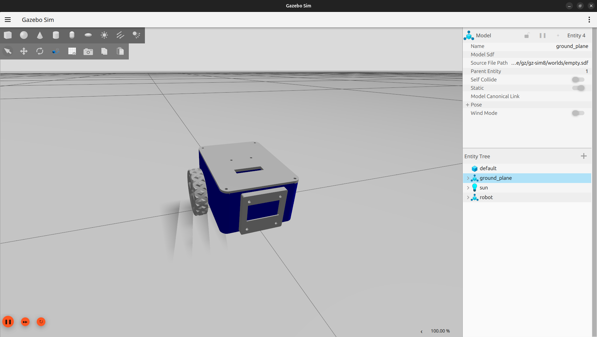
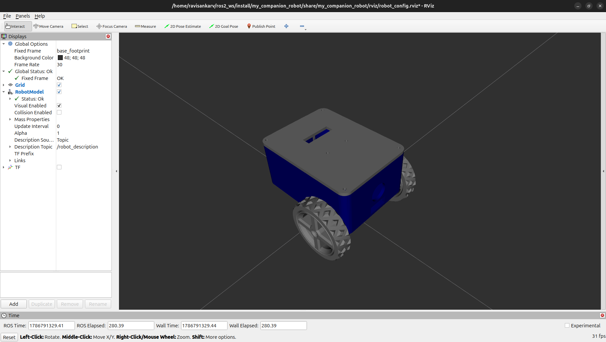

# desktop-companion-robot
ROS 2 Jazzy autonomous companion robot with Gazebo simulation, URDF, voice control using Faster-Whisper, and ROS 2 communication.


# 🤖 Desktop Companion Robot

A ROS 2 powered desktop companion robot designed around an ESP32-based mobile platform, voice interaction, and future LLM integration.

The goal of this project is to develop a flexible companion robot that can interact with users through natural language and eventually use an LLM as its higher-level intelligence layer.

> 🚧 **Project Status:** ROS 2 software and Gazebo simulation are completed. The physical hardware integration and LLM integration are currently in progress.

---

## 📌 Overview

The **Desktop Companion Robot** is a personal robotics project built using **ROS 2 Jazzy**.

The project is being developed in multiple stages:

1. **ROS 2 software and simulation**
2. **Physical robot hardware**
3. **LLM-powered interaction and intelligence**

The ROS 2 software side currently includes:

* Custom robot URDF/Xacro model
* Gazebo simulation
* RViz visualization
* ROS 2 launch system
* Voice recognition using Faster-Whisper
* ROS 2 communication between speech recognition and robot control
* Voice-controlled robot movement in simulation

The physical robot body has already been 3D printed using the custom robot model. The custom PCB and electronics integration are currently under development.

The long-term goal is to turn the robot into a fully fledged **interactive desktop companion** using an LLM.

---

# 🎯 Project Goal

The main objective is to create an **ESP32-powered companion robot that uses ROS 2 and an LLM to provide interactive behaviour**.

Rather than designing the robot for a single fixed application, the project is intended to provide a flexible robotics platform that can be configured for different behaviours through software.

With an LLM integrated into the system, the robot could eventually understand natural-language requests, hold conversations, interpret tasks, and interact with the physical robot through ROS 2.

---

# 🧠 Current System

The current software pipeline is:

```text
                  ┌─────────────────┐
                  │    Microphone   │
                  │    (Computer)   │
                  └────────┬────────┘
                           │
                           ▼
                  ┌─────────────────┐
                  │ Faster-Whisper  │
                  │ Speech-to-Text  │
                  └────────┬────────┘
                           │
                           │ /speech_text
                           ▼
                  ┌─────────────────┐
                  │   move_robot    │
                  │    ROS 2 Node   │
                  └────────┬────────┘
                           │
                           ▼
                  ┌─────────────────┐
                  │     Gazebo      │
                  │ Robot Simulation│
                  └─────────────────┘
```

The current system demonstrates the complete software pipeline from:

**Human voice → Speech recognition → ROS 2 → Robot movement**

---

# 🚀 Current Status

| Component                            | Status         |
| ------------------------------------ | -------------- |
| ROS 2 Jazzy                          | ✅ Completed    |
| Robot URDF/Xacro                     | ✅ Completed    |
| Gazebo simulation                    | ✅ Completed    |
| RViz visualization                   | ✅ Completed    |
| ROS 2 launch system                  | ✅ Completed    |
| Faster-Whisper speech recognition    | ✅ Completed    |
| Voice → ROS 2 communication          | ✅ Completed    |
| Voice-controlled Gazebo movement     | ✅ Completed    |
| 3D printed robot body                | ✅ Completed    |
| Custom PCB                           | 🚧 In progress |
| ESP32-C3 integration                 | 🚧 In progress |
| Motor integration                    | 🚧 In progress |
| Encoder integration                  | 🚧 In progress |
| LLM integration                      | 🚧 Planned     |
| Full desktop companion functionality | 🚧 Planned     |

---

# 🖥️ Software Stack

| Component           | Technology         |
| ------------------- | ------------------ |
| Operating System    | Ubuntu 24.04.4 LTS |
| Robotics Middleware | ROS 2 Jazzy        |
| Simulation          | Gazebo Sim 8.11.0  |
| Visualization       | RViz               |
| Programming         | Python / C++       |
| Speech Recognition  | Faster-Whisper     |
| Robot Description   | URDF / Xacro       |
| Build System        | Colcon             |
| Version Control     | Git / GitHub       |

---

# 🏗️ ROS 2 Architecture

The project uses **ROS 2 Jazzy** as the main robotics middleware.

ROS 2 is responsible for communication between the speech recognition system, robot control system, simulation and eventually the physical robot.

The current architecture is designed so that the speech recognition and robot control components remain separate ROS 2 nodes.

```text
                   ┌──────────────────┐
                   │    Microphone    │
                   └────────┬─────────┘
                            │
                            ▼
                   ┌──────────────────┐
                   │ Faster-Whisper   │
                   │ Speech Recognition│
                   └────────┬─────────┘
                            │
                            │ /speech_text
                            ▼
                   ┌──────────────────┐
                   │   move_robot     │
                   │    ROS 2 Node    │
                   └────────┬─────────┘
                            │
                            ▼
                   ┌──────────────────┐
                   │     Gazebo       │
                   │ Robot Simulation │
                   └──────────────────┘
```

---

# 📦 ROS 2 Packages

The repository contains the ROS 2 packages currently required by the project.

## `my_companion_robot`

Contains the robot description and 3D models used by the simulation.

### Includes

* URDF/Xacro files
* Gazebo robot description
* Robot meshes
* Wheel meshes
* Castor wheel
* Motor brackets
* OLED enclosure
* Sensor mounting components
* RViz configuration

Structure:

```text
my_companion_robot/
├── launch/
├── meshes/
├── rviz/
├── urdf/
├── CMakeLists.txt
└── package.xml
```

---

## `my_robot_bringup`

Contains the launch files and configuration used to bring up the robot simulation.

### Includes

* Gazebo launch files
* Voice-control launch file
* ROS 2 configuration
* Gazebo bridge configuration
* Simulation world

Structure:

```text
my_robot_bringup/
├── config/
├── launch/
├── worlds/
├── CMakeLists.txt
└── package.xml
```

---

## `my_py_pkg`

Contains the robot movement ROS 2 node.

The main node used by this project is:

```text
move_robot.py
```

The node receives recognized commands through ROS 2 and translates them into movement commands for the simulated robot.

Current supported commands include:

```text
forward
back
left
right
stop
```

---

## `speech_recognition`

Contains the ROS 2 speech recognition node based on **Faster-Whisper**.

The node:

1. Captures audio from the computer microphone.
2. Processes the audio using Faster-Whisper.
3. Converts speech into text.
4. Publishes the recognized text through ROS 2.

The recognized speech is published on:

```text
/speech_text
```

---

# 🎙️ Voice Recognition

Voice recognition is currently performed on the development computer using its microphone.

The pipeline is:

```text
Computer Microphone
        │
        ▼
   Audio Capture
        │
        ▼
 Faster-Whisper
        │
        ▼
 Recognized Text
        │
        ▼
 /speech_text
        │
        ▼
  move_robot
        │
        ▼
     Gazebo
```

The current system recognizes movement commands such as:

```text
"forward"
"back"
"left"
"right"
"stop"
```

This provides the foundation for the future natural-language interaction system.

---

# 🎤 Faster-Whisper

The project uses **Faster-Whisper** for speech-to-text conversion.

Faster-Whisper is integrated into the ROS 2 `speech_recognition` package.

The speech recognition environment is isolated using a Python virtual environment.

## Create the Python Environment

From the ROS 2 workspace:

```bash
cd ~/ros2_ws
python3 -m venv .venv
```

Activate it:

```bash
source .venv/bin/activate
```

Install Faster-Whisper and the required audio-processing packages:

```bash
pip install faster-whisper
pip install sounddevice scipy numpy
```

If required by the speech node:

```bash
pip install soundfile
```

Faster-Whisper will install its required dependencies such as:

```text
ctranslate2
huggingface-hub
tokenizers
```

---

# 🧪 Faster-Whisper Model

The speech recognition node uses the `WhisperModel` class from Faster-Whisper.

The model configuration is defined inside:

```text
src/speech_recognition/speech_recognition/speech_node.py
```

To inspect the current configuration:

```bash
grep -A5 "WhisperModel" \
src/speech_recognition/speech_recognition/speech_node.py
```

The model configuration can be changed directly in the speech recognition node depending on available CPU/GPU resources.

---

# 💻 System Requirements

The current development environment uses:

```text
Ubuntu 24.04.4 LTS
ROS 2 Jazzy
Gazebo Sim 8.11.0
Python 3
```

Check Ubuntu version:

```bash
lsb_release -a
```

Check the ROS 2 distribution:

```bash
echo $ROS_DISTRO
```

Expected:

```text
jazzy
```

Check Gazebo version:

```bash
gz sim --version
```

Expected:

```text
Gazebo Sim, version 8.11.0
```

---

# 🛠️ Installation

## 1. Clone the Repository

```bash
git clone https://github.com/HaraazRSV7/desktop-companion-robot.git
```

Enter the repository:

```bash
cd desktop-companion-robot
```

---

## 2. Build the ROS 2 Workspace

The project uses a ROS 2 workspace.

Navigate to the workspace:

```bash
cd ~/ros2_ws
```

Build the project:

```bash
colcon build
```

After building:

```bash
source install/setup.bash
```

---

# ▶️ Running the Project

## Gazebo Simulation

To launch the companion robot simulation:

```bash
ros2 launch my_robot_bringup my_companion_robot.launch.xml
```

This launches the robot in Gazebo.

---

# 🎙️ Voice-Controlled Simulation

The project also includes a voice-controlled simulation using Faster-Whisper.

The speech recognition node captures audio from the computer microphone and publishes recognized commands to:

```text
/speech_text
```

The robot movement node subscribes to this topic and converts the recognized commands into movement commands.

Supported commands:

```text
forward
back
left
right
stop
```

### Voice-Control Launch

```bash
ros2 launch my_robot_bringup my_companion_robot_speech_move_display.launch.xml
```

> Make sure the Python virtual environment containing Faster-Whisper is activated before running the speech recognition node.

Activate it with:

```bash
source ~/ros2_ws/.venv/bin/activate
```

Then source ROS 2:

```bash
source /opt/ros/jazzy/setup.bash
```

And the workspace:

```bash
source ~/ros2_ws/install/setup.bash
```

---

# 🔌 ROS 2 Communication

The current speech-control system uses:

```text
/speech_text
```

with:

```text
std_msgs/msg/String
```

The communication flow is:

```text
speech_recognition_node
          │
          │ publishes
          ▼
     /speech_text
          │
          │ subscribes
          ▼
      move_robot
```

The movement node then communicates with the simulated robot through the appropriate ROS 2/Gazebo interfaces.

---

# 🤖 Hardware Architecture

The physical robot is currently under development.

The robot body has already been 3D printed from the custom robot model used in the ROS 2 simulation.

The planned hardware architecture consists of:

```text
                  ┌────────────────────┐
                  │    ESP32-C3        │
                  │     SuperMini      │
                  └─────────┬──────────┘
                            │
             ┌──────────────┼──────────────┐
             │              │              │
             ▼              ▼              ▼
       ┌──────────┐   ┌──────────┐   ┌─────────────┐
       │ DRV8833  │   │ SSD1306  │   │   Sensors   │
       │  Driver  │   │  OLED    │   │  (Future)   │
       └────┬─────┘   └──────────┘   └─────────────┘
            │
       ┌────┴────┐
       │         │
       ▼         ▼
    N20 Motor  N20 Motor
    + Encoder  + Encoder
```

### Planned Hardware

* **ESP32-C3 SuperMini**
* **DRV8833 Dual Motor Driver**
* **2 × N20 DC Motors with Encoders**
* **0.96" I2C OLED Display**
* **SSD1306 OLED controller**
* **TP4056 1S LiPo Charger Module**
* **1S 3.7V LiPo Battery**

The physical electronics integration is still in progress.

---

# 🔋 Power Architecture

The planned power system uses a single-cell LiPo battery.

```text
3.7V 1S LiPo Battery
        │
        ▼
 TP4056 Charger
        │
        ├──────────────► ESP32-C3
        │
        └──────────────► Motor System
```

The exact power distribution and PCB implementation will be documented after the custom PCB is completed.

---

# 🧠 Future LLM Integration

One of the main future goals of this project is integrating an **LLM as the higher-level intelligence layer** of the robot.

The current system relies on predefined commands:

```text
forward
back
left
right
stop
```

The future system will move toward natural-language interaction.

The intended architecture is:

```text
                 Human
                   │
                   ▼
              Microphone
                   │
                   ▼
            Faster-Whisper
                   │
                   ▼
              Speech Text
                   │
                   ▼
                  LLM
            ┌──────┴──────┐
            │             │
            ▼             ▼
       Conversation   Task / Action
                          │
                          ▼
                       ROS 2
                          │
                          ▼
                    ESP32 Robot
```

The LLM will eventually be responsible for interpreting natural-language requests and deciding which robot capabilities should be used.

For example:

```text
"Move closer to me."

"Go to the other side of the table."

"Stop moving."

"Tell me something interesting."

"What can you see?"
```

The exact LLM, inference architecture, ROS 2 interface and tool-calling system are still under development.

---

# 🗺️ Roadmap

## Phase 1 — ROS 2 Software

* [x] ROS 2 Jazzy workspace
* [x] Robot URDF/Xacro
* [x] Custom robot meshes
* [x] Gazebo simulation
* [x] RViz visualization
* [x] ROS 2 launch system
* [x] Faster-Whisper integration
* [x] Speech-to-text
* [x] ROS 2 `/speech_text` communication
* [x] Voice-controlled simulated movement

## Phase 2 — Physical Robot

* [x] Robot 3D model
* [x] 3D printed robot body
* [ ] Custom PCB
* [ ] ESP32-C3 integration
* [ ] DRV8833 motor driver integration
* [ ] N20 motor integration
* [ ] Encoder feedback
* [ ] OLED integration
* [ ] Battery/power integration
* [ ] Physical robot movement

## Phase 3 — ROS 2 + Hardware

* [ ] micro-ROS integration
* [ ] ROS 2 ↔ ESP32 communication
* [ ] Encoder-based odometry
* [ ] Physical robot control
* [ ] Sensor integration

## Phase 4 — Intelligence

* [ ] LLM integration
* [ ] Natural-language interaction
* [ ] LLM → ROS 2 command interface
* [ ] Tool/action execution
* [ ] Context-aware interaction
* [ ] Autonomous companion behaviours
* [ ] Full-fledged desktop companion

---

# 📸 Simulation & Visualization

## Gazebo Simulation

The robot has been successfully modeled and simulated in Gazebo using its custom URDF/Xacro description.



---

## RViz Visualization

The robot model can also be visualized and inspected in RViz.



Additional RViz views and configurations are available in the `docs/images/` directory:

* `Companion_Robot2_RViz.png`
* `Companion_Robot3_RViz.png`
* `Companion_Robot4_RViz.png`

---

## 🎙️ Voice-Controlled Simulation

The ROS 2 simulation can be controlled using voice commands through Faster-Whisper.

Currently supported commands include:

```text
forward
back
left
right
stop
```

The voice recognition pipeline is:

```text
Microphone
    ↓
Faster-Whisper
    ↓
/speech_text
    ↓
move_robot
    ↓
Gazebo
```

A demonstration video will be added as the voice-control implementation is further documented.

---

## 🚧 Physical Robot

The physical robot body has been 3D printed based on the custom robot model used in the ROS 2 simulation.

Hardware integration, including the ESP32-C3, motor driver, motors, encoders, OLED display and custom PCB, is currently in progress.

Photos of the physical robot and electronics will be added as development progresses.

---

# 🚧 Current Limitations

The current version is primarily a **ROS 2 software and simulation implementation**.

The following components are not yet fully integrated into the physical robot:

* ESP32-C3
* DRV8833 motor driver
* 2 × N20 DC motors with encoders
* Encoder feedback
* 0.96" I2C OLED display
* Custom PCB
* Battery system
* micro-ROS
* LLM

The current Faster-Whisper implementation also runs on the development computer and uses the computer's microphone.

---

# 📁 Repository Structure

```text
desktop-companion-robot/
│
├── README.md
├── LICENSE
├── .gitignore
│
├── docs/
│   └── images/
│       ├── Comapanion_Robot_Gazebo.png
│       ├── Companion_Robot1_RViz.png
│       ├── Companion_Robot2_RViz.png
│       ├── Companion_Robot3_RViz.png
│       └── Companion_Robot4_RViz.png
│
└── src/
    │
    ├── my_companion_robot/
    │   ├── launch/
    │   ├── meshes/
    │   ├── rviz/
    │   ├── urdf/
    │   ├── CMakeLists.txt
    │   └── package.xml
    │
    ├── my_py_pkg/
    │   ├── my_py_pkg/
    │   │   ├── __init__.py
    │   │   └── move_robot.py
    │   ├── resource/
    │   ├── package.xml
    │   ├── setup.cfg
    │   └── setup.py
    │
    ├── my_robot_bringup/
    │   ├── config/
    │   ├── launch/
    │   ├── worlds/
    │   ├── CMakeLists.txt
    │   └── package.xml
    │
    └── speech_recognition/
        ├── speech_recognition/
        │   ├── __init__.py
        │   └── speech_node.py
        ├── resource/
        ├── test/
        ├── package.xml
        ├── setup.cfg
        └── setup.py
```

---

# 📚 Technologies & Open Source

This project is built using open-source technologies including:

* [ROS 2](https://www.ros.org/)
* [Gazebo](https://gazebosim.org/)
* [Faster-Whisper](https://github.com/SYSTRAN/faster-whisper)
* Python
* Ubuntu
* ESP32 ecosystem

Each dependency remains subject to its respective license.

---

# 📜 License

This project is licensed under the **MIT License**.

See the [LICENSE](LICENSE) file for details.

---

# 👨‍💻 Author

**Ravisankar V**

Electrical & Electronics Engineering
Robotics | ROS 2 | Embedded Systems

---

## ⭐ Project Status

This project is actively being developed.

The current milestone is the completion of the ROS 2 simulation and voice-control software. Development is now moving toward the **custom PCB, ESP32 hardware integration, physical robot control, and LLM-powered interaction**.
